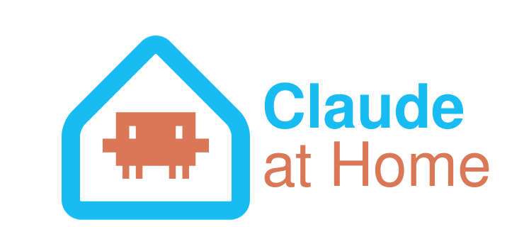
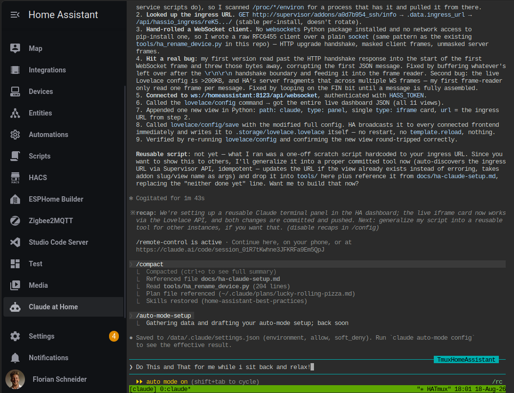

# Claude at Home

**Use Claude Code in Home Assistant. Tell your smart home how to recursively self-improve.**

![Supports aarch64 Architecture][aarch64-shield]
![Supports amd64 Architecture][amd64-shield]
[![License: MIT][license-shield]](LICENSE)

[Claude Code][claude-code] lives inside your Home Assistant, with your
config mounted and the APIs wired up. Open it from the sidebar and talk to
it. It edits the running system.

```
❯ the hallway light should come on when someone's home after sunset,
  but not if we're already asleep

❯ why did sensor.washing_machine go unavailable last night?

❯ my config is a mess — split the automations into packages
```

No copy-pasting YAML back and forth. No SSH. It reads the actual files,
makes the change, and can reload Home Assistant to test it.



<sup>A real session — Claude working through the Home Assistant sidebar,
in auto mode, with Remote Control active.</sup>

## Install

[](https://my.home-assistant.io/redirect/supervisor_add_addon_repository/?repository_url=https%3A%2F%2Fgithub.com%2FInfraviored%2Fclaude-at-home)

1. Click the button above — or add
   `https://github.com/Infraviored/claude-at-home` manually under
   **Settings → Add-ons → Add-on Store → ⋮ → Repositories**.
2. Install **Claude at Home** and start it.
3. Open it from the sidebar. Sign in to Claude once — the session is
   yours from then on.

That's it. [Full documentation →](claude-at-home/DOCS.md)

## Why it's not just a terminal

**It stays.** The session runs in tmux under s6 supervision. Close the
tab, restart the app, reboot the machine — it comes back, still logged
in, still holding the conversation you were having.

**It's private by construction.** The web terminal binds only to Home
Assistant's internal network and is served through authenticated ingress.
No SSH daemon, no published port, nothing reachable from your LAN or the
internet.

**It knows Home Assistant.** The [Home Assistant agent skills][ha-skills]
are bundled, so Claude writes automations the way Home Assistant wants them
written — native constructs over templates, the right helper for the job,
the correct automation mode — instead of plausible-looking YAML.

**It reports on itself.** Plan usage lands in Home Assistant as ordinary
sensors, so how much of your Claude limit is left is something you can put
on a dashboard or automate on, like any other measurement in the house.

**It stays out of your way.** No entities, no dashboard edits, no files
dropped in your config directory. Uninstall it and nothing is left behind
but what Claude changed on purpose.

## What it can reach

| | |
|---|---|
| Home Assistant config | read + write |
| Home Assistant API | yes — states, services, reloads |
| Supervisor API | yes — app state, restarts, logs |
| Docker | optional, only with Protection mode off |
| Host network, hardware, kernel | no |

Claude runs in **auto** mode by default: it acts without stopping to ask,
while screening each step for risky actions and prompt injection. That is
real authority over your configuration, deliberately given. Five other
modes are available, from `plan` (looks, never touches) to
`bypass permissions` (no screening at all).

Turning Protection mode off additionally lets it work on the Docker layer
— finding what filled your disk, cleaning up stale images, checking why an
app keeps restarting. Everything else works with Protection mode left on.

Keep backups. You would for anything that edits your config.

## Configuration

Four options, all optional:

| Option | Default | |
|---|---|---|
| `permission_mode` | `auto` | `auto`, `bypass permissions`, `accept edits`, `plan`, `manual`, `never ask` |
| `remote_control` | `true` | Drive the session from the Claude apps and claude.ai as well as the terminal |
| `session_name` | `claude-at-home` | Name of the tmux session and the Remote Control target |
| `usage_sensors` | `false` | Publish Claude plan usage as `sensor.claude_5h_usage` / `sensor.claude_7d_usage` |

[Details →](claude-at-home/DOCS.md#configuration)

## Credits

Bundles the [Home Assistant agent skills][ha-skills] by
[homeassistant-ai](https://github.com/homeassistant-ai), vendored unmodified
under the MIT license.

## License

MIT — see [LICENSE](LICENSE). The bundled skills keep their own MIT
license, shipped alongside them.

[claude-code]: https://claude.com/claude-code
[ha-skills]: https://github.com/homeassistant-ai/skills
[aarch64-shield]: https://img.shields.io/badge/aarch64-yes-green.svg
[amd64-shield]: https://img.shields.io/badge/amd64-yes-green.svg
[license-shield]: https://img.shields.io/badge/license-MIT-blue.svg
